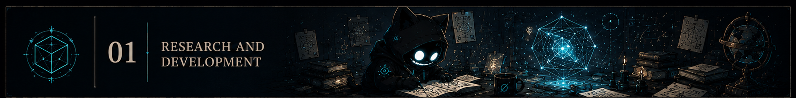
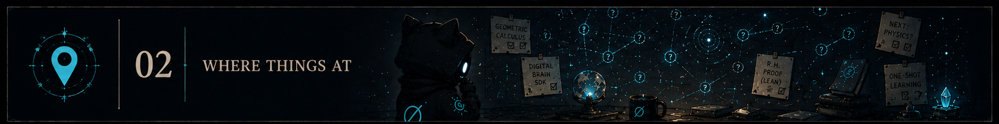
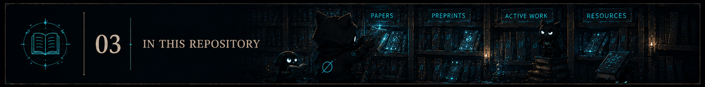

# Walter Henrique Alves da Silva — Research

This repository is my R&D , it holds the published papers and active work on a geometric description of thought and language.

From a research standpoint, my home is in psychology and my first paper (At the Border of Chaos) is essentially a philosophy one, from then on it gets a bit more mathematical.

I am an essentially self-taught, most things here were derived from first principles in my leisure time.

What I'm actively building (and where these theoretical tools get applied) is https://github.com/faltz009/open-research-network

---

## Where Things Are At

### Geometric Calculus

The toolset is already running — the Closure SDK and the digital brain built on it are public and fully operational. The paper is human-written through page 9, with the remaining sections and figures coming. The point of making it public now is that the math is done and the code works; the accessible explanation is being written around something that already exists rather than pitched ahead of it.

[Geometric Calculus →](./Geometric%20Calculus/) · DOI: [10.5281/zenodo.20349033](https://doi.org/10.5281/zenodo.20349033)

---

### The Geometric Computer

If you want to understand the library or build on it, this is the primary reference. It documents what the digital brain does and why — how it computes, learns one-shot, consolidates during quiet periods, and self-monitors — and argues that this architecture is a more natural fit for certain problems than the standard gradient descent approach. Eight experiments verify every claim.

[The Geometric Computer →](./The%20Geometric%20Computer/) · DOI: [10.5281/zenodo.19578024](https://doi.org/10.5281/zenodo.19578024)

---

### A Geometric Definition of Zero

To make learning work on the geometric computer I needed a definition of a learning event — a genuinely novel state, something that wasn't there before. Those turn out to be prime states in the geometry, and working out what that means precisely led to a geometric proof of the Riemann Hypothesis falling out as a consequence, which I formalized in Lean 4 — if any mathematicians want to look at it and tell me what's wrong, that would be genuinely useful.

[A Geometric Definition of Zero →](./A%20Geometric%20Definition%20of%20Zero/) · DOI: [10.5281/zenodo.19427453](https://doi.org/10.5281/zenodo.19427453)  
[Lean 4 proof →](https://github.com/faltz009/geometric-zero-rh)

---

### The Shape of Reality (+ Agent Self-Discovery)

I wasn't planning to go this deep into physics, but the numbers kept working. A supervised agent ran an independent discovery pass on the framework and came back with a set of physics predictions — particle masses, the fine structure constant, the proton-to-electron mass ratio — accurate enough at sub-ppm that I couldn't just leave them. Some results are already at theorem level, some still need derivation. The data and open problems are in `The Shape of Reality/Pending-Revisions/`, and anyone who wants to dig into the physics is welcome to.

[The Shape of Reality →](./The%20Shape%20of%20Reality/) · DOI: [10.5281/zenodo.18906682](https://doi.org/10.5281/zenodo.18906682)  
[Active research workspace →](./The%20Shape%20of%20Reality/Pending-Revisions/)

---

## Published Papers

In chronological order:

1. [At the Border of Chaos](./At%20the%20Border%20of%20Chaos/) — The geometry of information; discretization as the primitive operation. DOI: [10.31234/osf.io/4nv79_v1](https://doi.org/10.31234/osf.io/4nv79_v1)

2. [The Geometrical Theory of Communication](./The%20Geometrical%20Theory%20of%20Communication/) — How information becomes meaningful through algebraic operations. DOI: [10.5281/zenodo.15715747](https://doi.org/10.5281/zenodo.15715747)

3. [The Holy Trinity of Information](./The%20Holy%20Trinity%20of%20Information/) — The S1/S2/S3 triadic architecture; A?=A as the universal primitive. DOI: [10.5281/zenodo.15898912](https://doi.org/10.5281/zenodo.15898912)

4. [Information Evolution Dynamics](./Information%20Evolution%20Dynamics/) — How genuine novelty is generated; the third operation beyond persistence and elimination. DOI: [10.5281/zenodo.17156438](https://doi.org/10.5281/zenodo.17156438)

5. [Computational Chemistry: Hydrogen and the Ruliad](./Computational%20Chemistry:%20Hydrogen%20and%20the%20Ruliad/) — Hydrogen as the minimal physical instantiation of the verification structure. DOI: [10.5281/zenodo.17705796](https://doi.org/10.5281/zenodo.17705796)

6. [The Shape of Reality](./The%20Shape%20of%20Reality/) — Particle masses and physical constants from S³ topology. DOI: [10.5281/zenodo.18906682](https://doi.org/10.5281/zenodo.18906682)

7. [The Zeroth Law: Identity and Coherence](./The%20Zeroth%20Law/) — Two foundational observations force the quaternion algebra and S³; the three theorems that diagnose any coherence failure. DOI: [10.5281/zenodo.19140055](https://doi.org/10.5281/zenodo.19140055)

8. [Geometric Prediction Error: Free Energy on Lie Groups](./Geometric%20Prediction%20Error/) — Friston's FEP reformulated on compact Lie groups; exact propagation and uniform sensitivity as theorems. DOI: [10.5281/zenodo.19052561](https://doi.org/10.5281/zenodo.19052561)

9. [A Geometric Definition of Zero](./A%20Geometric%20Definition%20of%20Zero/) — Riemann zeros are Hopf closure events on S³; Lean 4 proof with zero sorry. DOI: [10.5281/zenodo.19427453](https://doi.org/10.5281/zenodo.19427453)

10. [The Geometric Computer](./The%20Geometric%20Computer/) — σ as the universal distance; digital brain; eight experiments. DOI: [10.5281/zenodo.19578024](https://doi.org/10.5281/zenodo.19578024)

11. [Geometric Calculus](./Geometric%20Calculus/) — σ-calculus from physical measurement; Euclid's fifth postulate proved false. DOI: [10.5281/zenodo.20349033](https://doi.org/10.5281/zenodo.20349033)

---

## Also in This Repository

- [Commentary on Levin, Stepney et al.](./Commentary%20on%20Levin,%20Susan%20Stepney,%20et%20all/) — Written in response to open questions on time and self-reference in living systems; documents the convergence between this framework and Levin's bioelectric cognition work.

---

## Support This Research

All of this is independent work done in my own time and released for free. If you find it useful or want to see it continue, any support helps.

| Method | Address |
|---|---|
| BTC | `155jaKugGGhdwX2Dp55bfHWpWbWD3Gr3PG` |
| ETH (ERC-20) | `0x31f0253180b03c16a0aa2d7091311d7363ef22a4` |
| SOL | `HdGFaL6A8z8AetnyPn6vKPU4QJGaSHBtoqPK32qbe6wV` |
| PIX (Brazil) | `walter.h057@gmail.com` |
